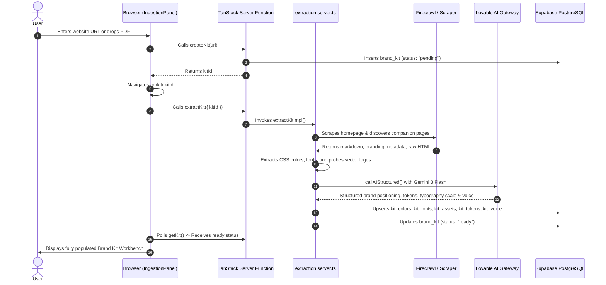

# Developer Guide & Contributor Manual

Welcome to the **Brand DNA / Brand Muse** developer manual. This document provides everything engineers need to know to set up, build, test, extend, and deploy the application.

---

## 📑 Table of Contents

- [System Requirements & Prerequisites](#system-requirements--prerequisites)
- [Quick Start: Local Environment Setup](#quick-start-local-environment-setup)
- [Repository Architecture & Code Organization](#repository-architecture--code-organization)
  - [High-Level Directory Map](#high-level-directory-map)
  - [Architectural Patterns: TanStack Start & Server Functions](#architectural-patterns-tanstack-start--server-functions)
  - [Client vs. Server Boundary Rules](#client-vs-server-boundary-rules)
- [Route Architecture & File-Based Routing](#route-architecture--file-based-routing)
- [Core Workflows & Pipelines](#core-workflows--pipelines)
  - [1. Brand Kit Extraction Pipeline](#1-brand-kit-extraction-pipeline)
  - [2. Deterministic vs. Generative Asset Pipeline](#2-deterministic-vs-generative-asset-pipeline)
  - [3. Export Generation Pipeline](#3-export-generation-pipeline)
- [Testing & Quality Assurance](#testing--quality-assurance)
  - [Unit & Integration Testing (Vitest)](#unit--integration-testing-vitest)
  - [End-to-End Testing (Playwright)](#end-to-end-testing-playwright)
  - [Custom Static Analysis Script (`check-await-build-brand-pdf.mjs`)](#custom-static-analysis-script-check-await-build-brand-pdfmjs)
  - [Linting and Formatting](#linting-and-formatting)
- [Database Migrations & Supabase Management](#database-migrations--supabase-management)
- [Production Build & Deployment](#production-build--deployment)
  - [Building for Production](#building-for-production)
  - [Deploying to Cloudflare Workers](#deploying-to-cloudflare-workers)
  - [Memory & Stack Size Tuning](#memory--stack-size-tuning)
- [Coding Standards & Conventions](#coding-standards--conventions)

---

## System Requirements & Prerequisites

Before setting up the repository locally, ensure your machine has:
- **Node.js**: `v20.x` or higher (LTS recommended)
- **Bun**: `v1.1+` (recommended for ultra-fast package management and local script execution)
- **npm** or **pnpm**
- **Git**
- A [Supabase](https://supabase.com/) project (with Database and Storage initialized)

---

## Quick Start: Local Environment Setup

1. **Clone the repository**:
   ```bash
   git clone https://github.com/girishlade111/brand-muse-79.git
   cd brand-muse-79
   ```

2. **Install dependencies**:
   ```bash
   # Using npm
   npm install

   # Or using Bun
   bun install
   ```

3. **Configure Environment Variables**:
   Copy the example `.env` file:
   ```bash
   cp .env.example .env
   ```
   Open `.env` in your editor and configure your Supabase and AI keys (refer to [ENVIRONMENT_AND_CONFIGURATION.md](file:///c:/Users/Girish%20Lade/OneDrive/Desktop/brand-muse-79/ENVIRONMENT_AND_CONFIGURATION.md) for variable definitions).

4. **Launch the Development Server**:
   ```bash
   npm run dev
   ```
   The local dev server boots Vite with HMR and TanStack route generation. Open [http://localhost:3000](http://localhost:3000) in your browser.

---

## Repository Architecture & Code Organization

### High-Level Directory Map

```text
brand-muse-79/
├── .agents/                    # Custom agent skills and workflows
├── e2e/                        # Playwright automated browser tests
├── scripts/                    # Custom build scripts and lint validators
│   └── check-await-build-brand-pdf.mjs  # AST/lexical static check
├── src/
│   ├── components/             # Reusable React UI components
│   │   ├── ui/                 # Radix UI + Tailwind primitive components
│   │   ├── extraction-progress.tsx  # Ingestion animation & progress tracker
│   │   ├── ingestion-panel.tsx # Multi-modal input (URL, PDF, assets)
│   │   ├── quiet-loader.tsx    # Minimalist status indicators
│   │   ├── recent-kits.tsx     # Home page archive of recently viewed kits
│   │   ├── site-header.tsx     # Persistent navigation header
│   │   └── smooth-scroll.tsx   # Precision scroll controller
│   ├── hooks/                  # Custom React hooks (use-mobile, etc.)
│   ├── integrations/           # Third-party SDK wrappers & clients
│   │   ├── lovable/            # Lovable Cloud Auth OAuth provider
│   │   └── supabase/           # Client, server admin, middleware & types
│   ├── lib/                    # Business logic & server functions
│   │   ├── anon.ts             # Anonymous user UUID persistence
│   │   ├── auth.tsx            # React authentication context provider
│   │   ├── color.ts            # WCAG 2.1 contrast ratio algorithms
│   │   ├── exports.ts          # CSS, Tailwind, PDF, Tokens & ZIP export engine
│   │   ├── font-loader.ts      # Dynamic Google Fonts preview loader
│   │   ├── kits.functions.ts   # Server function: CRUD operations for brand kits
│   │   ├── logo-variants.functions.ts # Resvg WASM + fast-png variant generator
│   │   └── uploads.functions.ts# Server function: Supabase asset uploader
│   ├── routes/                 # File-based TanStack Start routes
│   │   ├── __root.tsx          # Master layout with providers & Toaster
│   │   ├── index.tsx           # Home landing & extraction submission
│   │   ├── kit.$kitId.tsx      # Comprehensive Brand Kit Workbench (2,500+ lines)
│   │   ├── build.tsx           # Manual kit builder interface
│   │   ├── library.tsx         # User's saved kits catalog
│   │   ├── design.tsx          # Live rendered DESIGN.md documentation
│   │   ├── design.history.tsx  # Design system version history
│   │   ├── design.history.diff.tsx # Side-by-side visual diff tool
│   │   ├── share.$shareToken.tsx   # Public read-only client presentation view
│   │   └── start-here.tsx      # Template guide and connector setup
│   ├── server/                 # Server-only extraction & scraping logic
│   │   ├── ai.server.ts        # AI gateway, backoff retries, and Firecrawl caller
│   │   ├── css-colors.server.ts # Server-side stylesheet color extractor
│   │   ├── extraction.server.ts# Complete extraction orchestration pipeline
│   │   ├── fonts.server.ts     # Font detection and Google Fonts matcher
│   │   ├── logo-probe.server.ts# Probes vector SVGs, apple-touch-icons, favicons
│   │   ├── manual.server.ts    # Manual kit persistence handler
│   │   ├── supabase-admin.server.ts # RLS-bypassing admin client singleton
│   │   └── url-guard.server.ts # SSRF protection and blocked URL validator
│   ├── routeTree.gen.ts        # Auto-generated TanStack route tree
│   ├── router.tsx              # Router instantiation & error boundary
│   └── styles.css              # Tailwind CSS v4 design tokens and theme rules
├── supabase/
│   ├── migrations/             # SQL migrations for Postgres schema
│   └── config.toml             # Supabase project configuration
├── DESIGN.md                   # Complete brand design philosophy specification
├── ENVIRONMENT_AND_CONFIGURATION.md # Environment variable guide
├── THIRD_PARTY_INTEGRATIONS.md # Integrations reference
├── package.json
├── tsconfig.json
├── vite.config.ts
└── wrangler.jsonc              # Cloudflare Workers configuration
```

---

### Architectural Patterns: TanStack Start & Server Functions

Brand DNA adopts **TanStack Start**, bringing type-safe full-stack capabilities to React:

1. **File-Based Routing**:
   Routes defined under `src/routes/` are automatically scanned by `@tanstack/router-plugin`, which continuously updates `src/routeTree.gen.ts`.
2. **Server Functions (`createServerFn`)**:
   Backend RPC methods are defined using `createServerFn` from `@tanstack/react-start`:
   ```typescript
   import { createServerFn } from "@tanstack/react-start";
   import { z } from "zod";

   export const getKit = createServerFn({ method: "GET" })
     .validator(z.object({ kitId: z.string().uuid(), ownerToken: z.string() }))
     .handler(async ({ data }) => {
       // Executes exclusively on the server / worker
       const { supabaseAdmin } = await import("@/integrations/supabase/client.server");
       // ...
       return result;
     });
   ```
3. **Server Function Invocations**:
   On the client, server functions are consumed using `useServerFn`:
   ```typescript
   const fetchKit = useServerFn(getKit);
   const kitData = await fetchKit({ data: { kitId, ownerToken } });
   ```

---

### Client vs. Server Boundary Rules

To ensure server secrets never leak into browser bundles and avoid build crashes:
1. **Never Import `.server.ts` Files into Components or Routes**:
   Files named `*.server.ts` (e.g. `src/server/ai.server.ts`, `src/server/supabase-admin.server.ts`) contain Node.js or secret credentials.
2. **Use Dynamic Imports Inside Server Handlers**:
   In `*.functions.ts` files, use `await import(...)` inside the handler function instead of static top-level imports. This ensures the client compiler tree-shakes server dependencies out of browser code.
3. **SSRF Guard**:
   All user-supplied URLs must pass through `isBlockedSourceUrl` from `src/server/url-guard.server.ts` before network requests are initiated, preventing Server-Side Request Forgery against localhost or private network ranges.

---

## Route Architecture & File-Based Routing

| Route | File Path | Type | Purpose |
|---|---|---|---|
| `/` | `src/routes/index.tsx` | Dynamic | Homepage with hero section, ingestion bar (URL/PDF/Upload), and recent kits archive. |
| `/kit/$kitId` | `src/routes/kit.$kitId.tsx` | Dynamic | Master Workbench for inspecting colors, typography, logos, design tokens, voice, and exports. |
| `/build` | `src/routes/build.tsx` | Dynamic | Hand-builder page for uploading custom assets and manually defining tokens. |
| `/library` | `src/routes/library.tsx` | Dynamic | Collection of saved brand kits with search and filter capabilities. |
| `/design` | `src/routes/design.tsx` | Static / SSR | Live documentation view of `DESIGN.md` (The Invisible Instrument design system). |
| `/design/history` | `src/routes/design.history.tsx` | Dynamic | Historical log of design system changes. |
| `/design/history/diff` | `src/routes/design.history.diff.tsx` | Dynamic | Side-by-side visual diff viewer between design system revisions. |
| `/share/$shareToken` | `src/routes/share.$shareToken.tsx` | Public | Read-only presentation view for sharing kits with clients. |
| `/start-here` | `src/routes/start-here.tsx` | Static / SSR | Interactive onboarding guide explaining features and connectors. |

---

## Core Workflows & Pipelines

### 1. Brand Kit Extraction Pipeline

The extraction lifecycle runs asynchronously to maintain UI responsiveness:



---

### 2. Deterministic vs. Generative Asset Pipeline

Located in `src/lib/logo-variants.functions.ts`:

- **Generative Mark Extraction (`logo-mark`)**:
  - SVG logos are rasterized to PNG using `@resvg/resvg-wasm`.
  - Sent to Google Gemini with a prompt instructing it to isolate the standalone icon/symbol from the wordmark text on a transparent background.
- **Deterministic Pixel Recoloring (`logo-on-light`, `logo-on-dark`, `logo-inverted`)**:
  - To prevent AI from altering kerning, shapes, or typography, pure pixel recoloring runs natively in TypeScript via `fast-png`.
  - Solid background colors are keyed out to alpha.
  - Remaining pixels are mapped to `#0A0A0A` (on-light) or `#F4EFE6` (on-dark).
  - Saved directly to Supabase storage bucket `brand-assets`.

---

### 3. Export Generation Pipeline

Located in `src/lib/exports.ts`:

- **`buildCSS(kit)`**: Generates a standard CSS custom properties file (`tokens.css`).
- **`buildTailwindTheme(kit)`**: Outputs a drop-in `tailwind.config.js` theme block.
- **`buildTokensJSON(kit)` & `buildTokensStudioJSON(kit)`**: Generates Figma Tokens / Tokens Studio compatible JSON trees.
- **`buildBrandPDF(kit)`**: Uses `jsPDF` to compile a multi-page, publication-grade PDF containing high-contrast color swatches, WCAG contrast verification, font specimen hierarchies, and brand voice rules.
- **`buildKitZip(kit)`**: Uses `JSZip` to bundle all exported files, SVGs, PNGs, and guidelines into a single `.zip` file for 1-click download.

---

## Testing & Quality Assurance

### Unit & Integration Testing (Vitest)

Brand DNA uses **Vitest** for fast, isolated unit and function tests.

Run tests:
```bash
npm run test
```

Vitest watches files during development or executes single runs in CI.

---

### End-to-End Testing (Playwright)

Full user journey and browser automation testing is powered by **Playwright**:
- Test directory: `e2e/`
- Configuration: [playwright.config.ts](file:///c:/Users/Girish%20Lade/OneDrive/Desktop/brand-muse-79/playwright.config.ts)

Run end-to-end tests:
```bash
npm run test:e2e
```

To run tests with a visible browser:
```bash
npx playwright test --headed
```

---

### Custom Static Analysis Script (`check-await-build-brand-pdf.mjs`)

File: [scripts/check-await-build-brand-pdf.mjs](file:///c:/Users/Girish%20Lade/OneDrive/Desktop/brand-muse-79/scripts/check-await-build-brand-pdf.mjs)

#### Why It Exists:
The export function `buildBrandPDF(kit)` is asynchronous and returns `Promise<Blob>`. If a developer calls `buildBrandPDF` without an `await`, JavaScript passes the unfulfilled Promise object into `JSZip` or `downloadBlob`. This causes silent export corruption where users download corrupted 0-byte PDFs.

#### How It Works:
This custom script is executed automatically as part of `npm run lint`. It recursively traverses `src/`, strips comments and string literals, finds all occurrences of `buildBrandPDF(`, and lexically verifies that each call is preceded by `await` (or wrapped in `await Promise.all(...)`).

If any unawaited call is detected, the build immediately halts with an exit code of `1` and outputs the exact file, line, and column:

```text
✗ buildBrandPDF must always be awaited. Found 1 un-awaited call site(s):

  src/routes/kit.$kitId.tsx:645:21
    Call: buildBrandPDF(data)
  >  645 |     const pdf = buildBrandPDF(data);
         |                 ^^^^^^^^^^^^^

    Fix: prefix the call with `await` (or wrap in `await Promise.all([...])`).
```

---

### Linting and Formatting

Run the linter and custom scripts:
```bash
npm run lint
```

Format the entire codebase with Prettier:
```bash
npm run format
```

---

## Database Migrations & Supabase Management

All database schema changes are tracked in `supabase/migrations/`:

1. **Create a Migration**:
   Create a timestamped `.sql` file in `supabase/migrations/`:
   ```sql
   -- Example: 20260920120000_add_custom_field.sql
   ALTER TABLE public.brand_kits ADD COLUMN IF NOT EXISTS notes text;
   ```

2. **Push Migrations to Remote Supabase**:
   ```bash
   npx supabase db push
   ```

3. **Regenerate TypeScript Definitions**:
   After schema updates, refresh `src/integrations/supabase/types.ts`:
   ```bash
   npx supabase gen types typescript --project-id hswnkqjteehponpcsdlw > src/integrations/supabase/types.ts
   ```

---

## Production Build & Deployment

### Building for Production

Compile client assets and server functions:
```bash
npm run build
```

The output bundle is generated into `dist/` and `.output/`.

---

### Deploying to Cloudflare Workers

The project is pre-configured with Cloudflare Workers via Nitro:

```bash
npx wrangler deploy
```

Wrangler uses the settings in [wrangler.jsonc](file:///c:/Users/Girish%20Lade/OneDrive/Desktop/brand-muse-79/wrangler.jsonc) to package the worker and ship it to the Cloudflare edge network.

---

### Memory & Stack Size Tuning

For systems encountering Node.js stack overflow errors during large TypeScript / Vite builds, use the dedicated memory-allocated script:
```bash
npm run build:dev
```
This runs Vite with `node --stack-size=16000`.

---

## Coding Standards & Conventions

1. **Aesthetic Discipline**:
   - Strictly adhere to [DESIGN.md](file:///c:/Users/Girish%20Lade/OneDrive/Desktop/brand-muse-79/DESIGN.md).
   - **Zero Radius (`0px`)**: Sharp corners everywhere. Avoid rounded pills or soft borders.
   - **Monochrome Foundation**: `#F4EFE6` (washi paper) and `#0A0A0A` (sumi ink). The only accent allowed is hanko seal red (`#8B1A1A`), reserved strictly for primary CTA active states.
2. **Typography Pairing**:
   - Cormorant Garamond for titles & hero display.
   - Courier Prime (uppercase, tracking `0.10em+`) for UI labels, badges, and buttons.
   - Libre Baskerville for readable prose and descriptions.
3. **Type Safety**:
   - Zero `any` where possible.
   - Validate all external API and server function payloads using **Zod** schemas.
