# Brand DNA / Brand Muse (The Invisible Instrument)

> **Precision Brand Design System Extractor & Kit Generator.**  
> Convert any company URL, PDF document, or uploaded brand asset into an actionable, production-ready design system in seconds. Extracts semantic color palettes with WCAG contrast verification, full typography hierarchies, logo variants, design tokens, and AI-synthesized brand voice guidelines.

---

[](https://react.dev/)
[](https://tanstack.com/start)
[](https://tailwindcss.com/)
[](https://www.typescriptlang.org/)
[](https://supabase.com/)
[](https://workers.cloudflare.com/)
[](LICENSE)

---

## 📑 Table of Contents

- [Overview & The Problem It Solves](#-overview--the-problem-it-solves)
- [Design Philosophy: The Invisible Instrument](#-design-philosophy-the-invisible-instrument)
- [System Architecture & Data Flow](#-system-architecture--data-flow)
- [✨ Core Features Deep Dive](#-core-features-deep-dive)
  - [1. Multi-Modal Ingestion](#1-multi-modal-ingestion)
  - [2. Semantic Color Intelligence & WCAG Contrast](#2-semantic-color-intelligence--wcag-contrast)
  - [3. Typography Hierarchy & Google Fonts Resolution](#3-typography-hierarchy--google-fonts-resolution)
  - [4. Logo Studio & Pixel-Perfect Variants](#4-logo-studio--pixel-perfect-variants)
  - [5. Design Tokens Engine](#5-design-tokens-engine)
  - [6. Brand Voice & AI Copywriting](#6-brand-voice--ai-copywriting)
  - [7. Version History & Visual Diff Viewer](#7-version-history--visual-diff-viewer)
  - [8. Frictionless Public Sharing](#8-frictionless-public-sharing)
- [📚 Dedicated Documentation Suite](#-dedicated-documentation-suite)
- [📂 Project Directory Structure](#-project-directory-structure)
- [🚀 Quick Start Guide](#-quick-start-guide)
  - [Prerequisites](#prerequisites)
  - [Installation](#installation)
  - [Environment Setup](#environment-setup)
  - [Running the Dev Server](#running-the-dev-server)
  - [Running Tests & Linting](#running-tests--linting)
- [📦 Export Formats Matrix](#-export-formats-matrix)
- [🗄 Database Schema (Supabase)](#-database-schema-supabase)
- [🌐 Cloudflare Workers Deployment](#-cloudflare-workers-deployment)
- [❓ Troubleshooting & FAQ](#-troubleshooting--faq)
- [🤝 Contributing & License](#-contributing--license)

---

## 🎯 Overview & The Problem It Solves

Assembling brand guidelines and developer handoff kits is traditionally a manual, fragmented, and error-prone process:

- **Painful Asset Hunting**: Engineers and designers waste hours inspecting DOM trees, scraping blurry SVG logos, guessing font weights, and extracting hex values from screenshots.
- **Inaccessible Color Palettes**: Brands frequently employ color combinations that fail WCAG accessibility standards, causing legal and usability problems in production applications.
- **Fragmented Handoffs**: Transferring a visual brand into code requires manually writing CSS variables, creating Tailwind theme configurations, building Figma tokens, and compiling PDF guidelines.

**Brand DNA** automates this entire pipeline. Whether you are in a **Sales / GTM** role preparing a hyper-personalized client pitch deck, a **Front-End Engineer** bootstrapping a client design system, or a **Designer** auditing visual identity, Brand DNA converts raw URLs or documents into production-ready design tokens in seconds.

---

## 🖋 Design Philosophy: The Invisible Instrument

Brand DNA is designed around the concept of **"The Invisible Instrument"** — drawing inspiration from traditional Japanese calligraphy (*Shodō*) and sumi ink on washi paper:

- **Target Aesthetic**: Quiet, surgical, high-contrast editorial minimalism. A precision scalpel, not a toy.
- **Zero Radius (`0px`)**: Sharp corners everywhere. No pill buttons or decorative rounded borders.
- **Palette**: Monochromatic core (`#F4EFE6` washi paper and `#0A0A0A` sumi ink) with single hanko seal red (`#8B1A1A`) reserved exclusively for primary CTA active moments.
- **Typography Pairing**:
  - **Display / Titles**: *Cormorant Garamond* (Bold, intentional ink strokes).
  - **Data / Labels / UI**: *Courier Prime* (Raw typewriter mono precision).
  - **Body Prose**: *Libre Baskerville* (Refined editorial readability).

*For the complete design philosophy, consult [DESIGN.md](file:///c:/Users/Girish%20Lade/OneDrive/Desktop/brand-muse-79/DESIGN.md).*

---

## 🏗 System Architecture & Data Flow

```mermaid
flowchart TD
    subgraph Ingestion ["1. Multi-Modal Ingestion"]
        URLInput["Website URL"]
        PDFInput["PDF Document Upload"]
        AssetDrop["Raw Image / Asset Drop"]
    end

    subgraph Processing ["2. Server Processing & Scraping"]
        Firecrawl["Firecrawl Web Scraper / Crawler"]
        DirectScrape["Direct HTML Scraper Fallback"]
        FontProbe["Font Detector & Google Fonts Resolver"]
        ColorParser["CSS Color Parser & Normalizer"]
        LogoProbe["SVG & Vector Logo Detector"]
    end

    subgraph Intelligence ["3. AI & Pixel Intelligence"]
        GeminiFlash["Google Gemini 3 Flash (Lovable AI Gateway)"]
        ResvgWasm["@resvg/resvg-wasm (Vector Rasterizer)"]
        FastPNG["fast-png (Deterministic Pixel Recoloring)"]
    end

    subgraph StorageLayer ["4. Supabase Backend"]
        PostgresDB[(PostgreSQL Database)]
        StorageBucket[("brand-assets" Storage Bucket)]
    end

    subgraph Workbench ["5. Interactive Workbench (/kit/:kitId)"]
        PaletteEditor["WCAG Palette & Luminance Matrix"]
        TypeSpecimens["Dynamic Font Specimen Previews"]
        LogoVariants["Monochrome, Dark, Light & Inverted Logos"]
        VoiceStudio["Brand Voice & Sample Copy Generator"]
    end

    subgraph ExportEngine ["6. Multi-Format Export Engine"]
        CSSVars["tokens.css"]
        TailwindCfg["tailwind.config.js"]
        FigmaTokens["tokens.json"]
        PDFGuide["brand-guidelines.pdf (jsPDF)"]
        ZipArchive["brand-kit.zip (JSZip)"]
        DesignDoc["DESIGN.md Context Prompt"]
    end

    Ingestion --> Processing
    Processing --> Intelligence
    Intelligence --> StorageLayer
    StorageLayer --> Workbench
    Workbench --> ExportEngine
```



---

## ✨ Core Features Deep Dive

### 1. Multi-Modal Ingestion
- **Website URL**: Deep URL scraping extracts favicons, high-resolution SVG/PNG logos, linked stylesheets, web fonts, and semantic text content.
- **Document & PDF Upload**: Ingest brand guides, decks, and style sheets directly using client-side and server-side PDF parsing (`unpdf`).
- **Asset Drop**: Drag-and-drop imagery, logos, or raw hex code strings.
- **Multi-Page Discovery**: Automatically crawls companion pages (`/about`, `/mission`, `/product`, `/pricing`) to synthesize comprehensive brand context.

### 2. Semantic Color Intelligence & WCAG Contrast
- **Automatic Role Assignment**: Maps extracted colors to semantic roles (`Primary`, `Secondary`, `Background`, `Surface`, `Text`, `Accent`, `Chart-1`, `Chart-2`).
- **WCAG Contrast Ratios**: Automated AA and AAA contrast ratio verification with relative luminance analysis against both light and dark backgrounds.
- **Interactive Palette Editor**: Rename colors, lock values during re-extraction, edit hex codes, or add custom brand swatches.

### 3. Typography Hierarchy & Google Fonts Resolution
- **Scale Detection**: Identifies display headings (`H1` through `H6`), body prose, and code/mono font sizes.
- **Google Fonts Auto-Resolution**: Resolves proprietary web fonts to open-source Google Font equivalents dynamically, with interactive live specimen previews.

### 4. Logo Studio & Pixel-Perfect Variants
- **Vector Discovery**: Detects SVG marks, icons, and primary wordmarks across DOM tags, `<link>` icons, and OpenGraph metadata.
- **Deterministic Pixel Manipulation**: Uses `fast-png` to recolor source logos into on-light (`#0A0A0A`), on-dark (`#F4EFE6`), and color-inverted variants without AI hallucinations or font distortion.
- **Generative Mark Extraction**: Uses `@resvg/resvg-wasm` and Google Gemini 3 Flash to cleanly isolate standalone icons from wordmark text on transparent backgrounds.

### 5. Design Tokens Engine
- Extracts spacing scales, structural border rules, elevation tokens, and animation durations/easings ready for immediate consumption in design tools and front-end frameworks.

### 6. Brand Voice & AI Copywriting
- Extracts tone of voice, key brand vocabulary, and explicit dos and don'ts.
- Automatically synthesizes on-brand sample copy tailored for sales outreach, landing page headers, and client proposals.

### 7. Version History & Visual Diff Viewer
- Built-in design system versioning (`/design/history`) allowing teams to inspect visual side-by-side diffs (`/design/history/diff`) between iterations of a brand kit.

### 8. Frictionless Public Sharing
- Generate secure public share tokens (`/share/$shareToken`) for read-only client presentations with zero login friction.

---

## 📚 Dedicated Documentation Suite

For comprehensive technical specifications, explore our dedicated topic guides:

| Document | Description |
|---|---|
| 🔧 **[ENVIRONMENT_AND_CONFIGURATION.md](file:///c:/Users/Girish%20Lade/OneDrive/Desktop/brand-muse-79/ENVIRONMENT_AND_CONFIGURATION.md)** | Complete environment variable reference (`.env`), client/server scopes, security rules, and deep dives into `vite.config.ts`, `wrangler.jsonc`, `tsconfig.json`, `styles.css`, and `playwright.config.ts`. |
| 🔌 **[THIRD_PARTY_INTEGRATIONS.md](file:///c:/Users/Girish%20Lade/OneDrive/Desktop/brand-muse-79/THIRD_PARTY_INTEGRATIONS.md)** | Detailed architecture of third-party services: Supabase PostgreSQL/Storage/Auth, Lovable AI Gateway & Google Gemini, Firecrawl scraping, Cloudflare Workers/Nitro, and WASM rendering engines. |
| 💻 **[DEVELOPER_GUIDE.md](file:///c:/Users/Girish%20Lade/OneDrive/Desktop/brand-muse-79/DEVELOPER_GUIDE.md)** | Comprehensive developer handbook covering local setup, TanStack Start server functions, testing (Vitest & Playwright), custom lint scripts (`check-await-build-brand-pdf.mjs`), and deployment. |
| 🎨 **[DESIGN.md](file:///c:/Users/Girish%20Lade/OneDrive/Desktop/brand-muse-79/DESIGN.md)** | Complete design system specification for "The Invisible Instrument" — color tokens, typography scales, spacing rhythm, and aesthetic philosophy. |

---

## 📂 Project Directory Structure

```text
brand-muse-79/
├── .agents/                    # Custom agent skills and workflows
├── e2e/                        # Playwright automated end-to-end tests
├── scripts/                    # Build scripts and lint validators
│   └── check-await-build-brand-pdf.mjs  # Lexical static analysis check
├── src/
│   ├── components/             # Reusable UI & layout components
│   │   ├── ui/                 # Radix UI + Tailwind primitive components
│   │   ├── extraction-progress.tsx  # Ingestion animation & progress tracker
│   │   ├── ingestion-panel.tsx # Multi-modal input interface (URL / PDF / Drop)
│   │   ├── quiet-loader.tsx    # Minimalist status indicators
│   │   ├── recent-kits.tsx     # Home page archive of recently viewed kits
│   │   ├── site-header.tsx     # Persistent navigation and brand header
│   │   └── smooth-scroll.tsx   # Precision scroll controller
│   ├── hooks/                  # Custom React hooks (use-mobile, etc.)
│   ├── integrations/           # Third-party service SDKs
│   │   ├── lovable/            # Lovable Cloud Auth OAuth provider
│   │   └── supabase/           # Client, server admin, middleware & types
│   ├── lib/                    # Core business logic & server functions
│   │   ├── anon.ts             # Anonymous user UUID persistence
│   │   ├── auth.tsx            # React authentication context provider
│   │   ├── color.ts            # WCAG contrast & luminance algorithms
│   │   ├── exports.ts          # CSS, Tailwind, PDF, Tokens & ZIP generators
│   │   ├── font-loader.ts      # Web font loader & specimen renderer
│   │   ├── kits.functions.ts   # Server functions for kit CRUD
│   │   ├── logo-variants.functions.ts # Resvg WASM + fast-png variant generator
│   │   └── uploads.functions.ts# Server functions for asset storage
│   ├── routes/                 # File-based TanStack Start routes
│   │   ├── __root.tsx          # Root layout with providers & Toaster
│   │   ├── index.tsx           # Home landing & extraction submission
│   │   ├── kit.$kitId.tsx      # Interactive brand kit workbench (2,500+ lines)
│   │   ├── build.tsx           # Manual kit builder interface
│   │   ├── library.tsx         # User's saved brand kits collection
│   │   ├── design.tsx          # Live rendered DESIGN.md documentation
│   │   ├── design.history.tsx  # Design system version history
│   │   ├── design.history.diff.tsx # Visual diff comparison tool
│   │   ├── share.$shareToken.tsx   # Public read-only client share view
│   │   └── start-here.tsx      # Onboarding guide and connector setup
│   ├── server/                 # Server-side extraction & AI pipeline
│   │   ├── ai.server.ts        # AI gateway, backoff retries, and Firecrawl caller
│   │   ├── css-colors.server.ts # Server-side stylesheet color parser
│   │   ├── extraction.server.ts# Complete extraction orchestration pipeline
│   │   ├── fonts.server.ts     # Font discovery and Google Fonts matcher
│   │   ├── logo-probe.server.ts# Probes vector SVGs, apple-touch-icons, favicons
│   │   ├── manual.server.ts    # Manual kit persistence handler
│   │   ├── supabase-admin.server.ts # RLS-bypassing admin client singleton
│   │   └── url-guard.server.ts # SSRF protection and blocked URL validator
│   ├── routeTree.gen.ts        # Auto-generated TanStack route tree
│   ├── router.tsx              # Router instantiation & error boundary
│   └── styles.css              # Tailwind CSS v4 design tokens and theme rules
├── supabase/
│   ├── migrations/             # SQL schema migrations
│   └── config.toml             # Local Supabase configuration
├── DESIGN.md                   # Full Design System specification
├── ENVIRONMENT_AND_CONFIGURATION.md # Environment variables & config guide
├── THIRD_PARTY_INTEGRATIONS.md # Integrations reference
├── DEVELOPER_GUIDE.md          # Developer manual
├── package.json
├── tsconfig.json
├── vite.config.ts
└── wrangler.jsonc              # Cloudflare Workers configuration
```

---

## 🚀 Quick Start Guide

### Prerequisites
- **Node.js**: `v20.x` or higher (or Bun `1.1+`)
- **npm** or **bun**
- **Git**
- A free [Supabase](https://supabase.com/) project

### Installation

1. **Clone the repository**:
   ```bash
   git clone https://github.com/girishlade111/brand-muse-79.git
   cd brand-muse-79
   ```

2. **Install dependencies**:
   ```bash
   npm install
   # Or using Bun
   bun install
   ```

### Environment Setup

Copy `.env.example` to `.env`:
```bash
cp .env.example .env
```

Configure your Supabase project credentials in `.env`:
```dotenv
SUPABASE_PROJECT_ID="your-project-id"
SUPABASE_PUBLISHABLE_KEY="your-supabase-publishable-key"
SUPABASE_URL="https://your-project-id.supabase.co"
SUPABASE_SERVICE_ROLE_KEY="your-service-role-key"

VITE_SUPABASE_PROJECT_ID="your-project-id"
VITE_SUPABASE_PUBLISHABLE_KEY="your-supabase-publishable-key"
VITE_SUPABASE_URL="https://your-project-id.supabase.co"

LOVABLE_API_KEY="your-lovable-api-key"
FIRECRAWL_API_KEY="your-firecrawl-api-key"
```

### Running the Dev Server

```bash
npm run dev
```
Open `http://localhost:3000` in your browser.

### Running Tests & Linting

```bash
# Run unit and integration tests with Vitest
npm run test

# Run end-to-end browser tests with Playwright
npm run test:e2e

# Run ESLint and custom static checks
npm run lint

# Format codebase with Prettier
npm run format
```

---

## 📦 Export Formats Matrix

Brand DNA enables 1-click export of brand kits across developer, designer, and executive formats:

| Format | Output File | Purpose & Compatibility |
|---|---|---|
| **CSS Custom Properties** | `tokens.css` | Native CSS custom properties ready for root injection in standard web applications. |
| **Tailwind CSS Config** | `tailwind.config.js` | Drop-in Tailwind theme extension block with mapped semantic colors and typography. |
| **Tokens Studio / Figma** | `tokens.json` | Compatible with Figma Tokens Studio plugin for instant design handoff. |
| **Brand Guidelines PDF** | `brand-guidelines.pdf` | Publication-grade vector PDF generated in-browser via `jsPDF` with swatches and type specimens. |
| **Complete ZIP Archive** | `brand-kit.zip` | Bundles all SVG logos, PNG variants, font specimens, token JSONs, and CSS files via `JSZip`. |
| **AI Design Prompt** | `DESIGN.md` | Context prompt for Lovable or AI web app builders specifying tokens and aesthetic rules. |

---

## 🗄 Database Schema (Supabase)

The application utilizes PostgreSQL tables in the `public` schema:

- **`brand_kits`**: Core kit metadata, source URL/text, brand positioning, typography scale, motion and imagery styles.
- **`kit_colors`**: Hex values, semantic roles, locking state, and display positions.
- **`kit_fonts`**: Primary, secondary, and mono font family configurations with Google Fonts mappings.
- **`kit_assets`**: Vector marks, logos, favicons, dimensions, and Supabase storage paths.
- **`kit_tokens`**: Spacing scales, border radius, elevation, and animation easing tokens.
- **`kit_voice`**: Tone attributes, vocabulary, dos/don'ts, and AI-generated sample copy.
- **`design_doc_versions`**: Audit log of changes to design system specifications.
- **`profiles`** & **`user_roles`**: User accounts and role-based permissions (`'admin'` | `'user'`).

---

## 🌐 Cloudflare Workers Deployment

Brand DNA compiles into a lightweight serverless bundle deployed to Cloudflare's global edge network:

```bash
# 1. Compile client bundle and server entry
npm run build

# 2. Deploy to Cloudflare Workers via Wrangler
npx wrangler deploy
```

Deployment configuration is governed by [wrangler.jsonc](file:///c:/Users/Girish%20Lade/OneDrive/Desktop/brand-muse-79/wrangler.jsonc), enabling `nodejs_compat` for cryptography and stream handling.

---

## ❓ Troubleshooting & FAQ

#### Q: Extraction failed with "Source URL is not allowed"
**A**: Brand DNA enforces SSRF protection via `src/server/url-guard.server.ts`. Localhost, private IP ranges (e.g., `127.0.0.1`, `10.0.0.0/8`, `192.168.0.0/16`), and internal cloud metadata endpoints are blocked for security.

#### Q: How does extraction work if I don't have a Firecrawl API key?
**A**: Firecrawl is optional. When no key is detected, Brand DNA gracefully falls back to `directScrape` in `src/server/ai.server.ts`, fetching HTML directly and parsing metadata, stylesheets, and favicon links.

#### Q: Why are logos sometimes recolored using code rather than AI?
**A**: Generative AI models often hallucinate letterforms, modify kerning, or crop logos when recoloring. Brand DNA uses `fast-png` to deterministically replace color pixels in the raw PNG bytes, ensuring 100% preservation of the original logo geometry.

#### Q: Why does `npm run lint` fail with "buildBrandPDF must always be awaited"?
**A**: `buildBrandPDF` returns `Promise<Blob>`. Calling it without `await` passes an unfulfilled Promise to `JSZip` or download helpers, resulting in corrupted 0-byte PDF downloads. Prefix the call with `await`.

---

## 🤝 Contributing & License

Contributions, bug reports, and feature requests are welcome!
1. Fork the repository
2. Create your feature branch (`git checkout -b feature/amazing-feature`)
3. Commit your changes (`git commit -m 'feat: add amazing feature'`)
4. Push to the branch (`git push origin feature/amazing-feature`)
5. Open a Pull Request

This project is licensed under the [MIT License](LICENSE).
